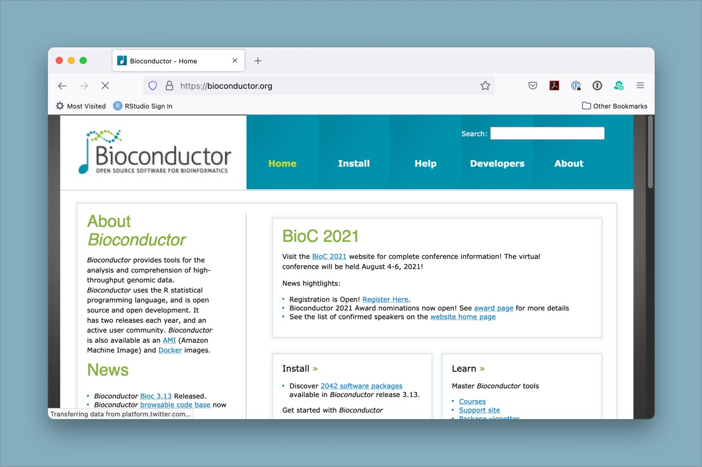
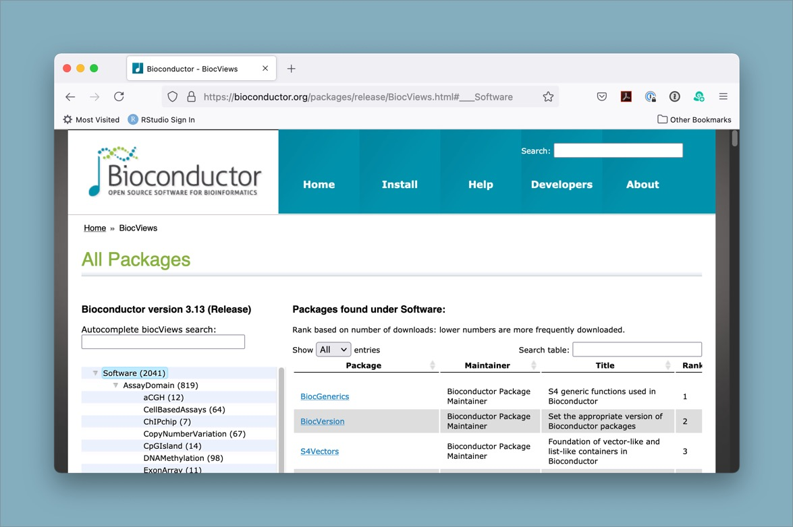

---
# Please do not edit this file directly; it is auto generated.
# Instead, please edit 04-bioconductor-vcfr.md in _episodes_rmd/
title: Using packages from Bioconductor
teaching: 10
exercises: 3
questions:
- "How do I use packages from the Bioconductor repository?"
objectives:
- "Describe what the Bioconductor repository is and what it is used for"
- "Describe how Bioconductor differs from CRAN"
- "Search Bioconductor for relevant packages"
- "Install a package from Bioconductor"
keypoints:
- "Bioconductor is an alternative package repository for bioinformatics packages."
- "Installing packages from Bioconductor requires a new method, since it is not compatible with the `install.packages()` function used for CRAN."
- "Check Bioconductor to see if there is a package relevant to your analysis before writing code yourself."
source: Rmd
---

## Installing packages from somewhere else besides CRAN?

So far we have told you about using packages that are included in the base installation of R (this is what comes with R 'out of the box'), and packages that you can install from [CRAN](https://cran.r-project.org/) (the Comprehensive R Archive Network), which is the primary place many people look for supplemental R packages to install. However, not all R packages are available on CRAN. For bioinformatics-related packages in particular, there is another repository that has many powerful packages that you can install. It is called [Bioconductor](https://bioconductor.org/) and it is a repository specifically focused on bioinformatics packages. [Bioconductor](https://bioconductor.org/) has a mission of "promot[ing] the statistical analysis and comprehension of current and emerging high-throughput biological assays." This means that many if not all of the packages available on Bioconductor are focused on the analysis of biological data, and that it can be a great place to look for tools to help you analyze your -omics datasets!

## So how do I use it?

Since access to the [Bioconductor](https://bioconductor.org/) repository is not built in to base R 'out of the box', there are a couple steps needed to install packages from this alternative source. We will work through the steps (only 2!) to install a package to help with the VCF analysis we are working on, but you can use the same approach to install any of the many thousands of available packages.

## First, install the `BiocManager` package

The first step is to install a package that *is* on CRAN, `BiocManager`. This package will allow us to use it to install packages from Bioconductor. You can think of Bioconductor kind of like an alternative app store for your phone, except instead of apps you are installing packages, and instead of your phone it's your local R package library.

~~~
# install the BiocManager from CRAN using the base R install.packages() function
install.packages("BiocManager")
~~~
{: .language-r}

To check if this worked (and also so you can make a note of the version for reproducibility purposes), you can run `BiocManager::version()` and it should give you the version number.

~~~
# to make sure it worked, check the version
BiocManager::version()
~~~
{: .language-r}

## Second, install the vcfR package from Bioconductor using `BiocManager`

> ## Head's Up: Installing vcfR may take a while due to numerous dependencies
>
> Just be aware that installing packages that have many dependencies can take a while.
>
{: .callout}

~~~
# install the vcfR package from bioconductor using BiocManager::install()
BiocManager::install("vcfR")
~~~
{: .language-r}
Depending on your particular system, you may need to also allow it to install some dependencies or update installed packages in order to successfully complete the process.

> ## Note: Installing packages from Bioconductor vs from CRAN 
> Some packages begin by being available only on Bioconductor, and then later
> move to CRAN. `vcfR` is one such package, which originally was only available
> from Bioconductor, but is currently available from CRAN. The other thing to
> know is that `BiocManager::install()` will also install packages from CRAN (it
> is a wrapper around `install.packages()` that adds some extra features). There
> are other benefits to using `BiocManager::install()` for Bioconductor
> packages, many of which are outlined
> [here](https://www.bioconductor.org/install/). In short, Bioconductor packages
> have a release cycle that is different from CRAN and the `install()` function
> is aware of that difference, so it helps to keep package versions in line with
> one another in a way that doesn't generally happen with the base R
> `install.packages()`.
>
{: .callout}

## Search for Bioconductor packages based on your analysis needs

While we are only focusing in this workshop on VCF analyses, there are hundreds or thousands of different types of data and analyses that bioinformaticians may want to work with. Sometimes you may get a new dataset and not know exactly where to start with analyzing or visualizing it. The Bioconductor package search view can be a great way to browse through the packages that are available.

> ## Tip: Searching for packages on the Bioconductor website
>
> There are several thousand packages available through the Bioconductor website.
> It can be a bit of a challenge to find what you want, but one helpful resource
> is the [package search page](https://bioconductor.org/packages/release/BiocViews.html#___Software).
>
{: .callout}

In bioinformatics, there are often many different tools that can be used in a
particular instance. The authors of `vcfR` have [compiled some of
them](https://github.com/knausb/vcfR#software-that-produce-vcf-files). One of
those packages that [is available from
Bioconductor](https://bioconductor.org/packages/release/bioc/html/VariantAnnotation.html)
is called `VariantAnnotation` and may also be of interest to those working with
vcf files in R.

> ## Challenge
>
> - Use the `BiocManager::available()` function to see what packages are available matching a search term.
> - Use the [biocViews](https://bioconductor.org/packages/release/BiocViews.html#___Software) interface to search for packages of interest.
>
> You may or may not want to try installing the package, since not all dependencies always install easily. However, this will at least let you see what is available. 
{: .challenge}

> ## Tip: Refreshing the RStudio package view after installing
>
> If you install a package from Bioconductor, you may need to refresh the RStudio package view to see it in your list. You can do this by clicking the "Refresh" button in the Packages pane of RStudio.
>
{: .callout}

## Resources

- [Bioconductor](https://bioconductor.org/)
- [Bioconductor package search](https://bioconductor.org/packages/release/BiocViews.html#___Software)
- [CRAN](https://cran.r-project.org/)
